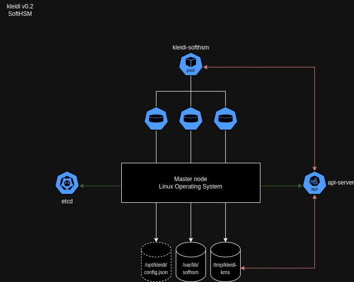

# kleidi KMS Provider Plugin for Kubernetes

## Current feature
* KMSv2 
* PKCS#11 interface with [SoftHSM](https://www.opendnssec.org/softhsm/).   
  **Note: it is intended to be used for PoC only, not for production use.**

## Why 1.29 or later?
Stability! Any prior release marked KMSv2 as non stable. Here is the extract from the [Kubernetes documentation](https://kubernetes.io/docs/tasks/administer-cluster/kms-provider/#before-you-begin):

*The version of Kubernetes that you need depends on which KMS API version you have selected. Kubernetes recommends using KMS v2.*

* *If you selected KMS API v2, you should use Kubernetes v1.29 (if you are running a different version of Kubernetes that also supports the v2 KMS API, switch to the documentation for that version of Kubernetes).*
* *If you selected KMS API v1 to support clusters prior to version v1.27 or if you have a legacy KMS plugin that only supports KMS v1, any supported Kubernetes version will work. This API is deprecated as of Kubernetes v1.28. Kubernetes does not recommend the use of this API.*

## Future feature

* production-grade SoftHSM implementation 
* (v)TPM integration
* HashiCorp Vault Community Edition/openbao integration. 


# Why a KMS Provider Plugin for Kubernetes? 

This is related to security exposure and how credential handling practice differs between application and infrastructure management with [physical/virtual] machine and with a container platform like Kubernetes. 

More to be said and understood with [Kubernetes Secrets Handbook](https://www.amazon.com/Kubernetes-Secrets-Handbook-production-grade-management/dp/180512322X)

## Physical/Virtual machine world
In the legacy world, the entire IT organization is segmented into knowledge domains like networking, storage, compute, application, etc. 
Each domain team has its own set of credentials, credentials that are never shared cross-domains. 
When an application team asks for a virtual machines:
- The VMware Team have their own set of credentials, that the Linux team doesn't have access to.
- The Linux team will configure, maintain, and support the operating system and will not share their credentials to any other team. 
- The application team will deploy their application that might have a connectiont to a database, well, the DBA will provide credentails.   

This quick overview can be enriched with all other layers like storage, backup, networking, monitoring, etc.

## Container Platform world
Within Kubernetes, all states and configurations of every single components from compute, to networking, to application, and more, are stored within the ```etcd``` key-value datastore. 

Even if cloud-native application are capable of interacting directly with an KMS provider Vault, there are still application **and** platform credentials all stored within the cluster. 

All data fields are encoded in base64 but not encrypted. 

## Security exposure

The following diagram takes a 10,000-feet overview to explore the security exposures leading to a potential secret leaking/spilling: 


- The secret comes from an external source and needs to be injected.  
- The base64 encoded secret will be ingested via the API server. 
- If there is a Kubernetes KMS provider plugin, then the API server will encrypt the data field with an envelop scheme. 
- The secret and its encrypted data filed will be stored within the ```etcd``` key-value datastore. 
- The ```etcd``` key-value datastore file is saved on a local volume on the control plane node filesystem. 

What are the exposures:
- The secret is coming from an external source which will need to transform the credentials into base64 encoded payload. This is a first level exposure of the data field that will be exposed at file and console levels. A common mistake is to commit the secret YAML definition in a repository. 
- If there is no KMS provider plugin, then the API server saved the base64 encoded secret within the ```etcd``` key-value datastore. 
- If there is a KMS provider plugin, then the payload will be encrypted and saved within the ```etcd``` key-value datastore. 
- Another challenge is related to the KMS provider plugin (and any applications) access to the KMS provider. This step requires to provide a mean to authenticate with the KMS provider which will need to be stored on the platform in clear.
- In both cases, if there is API server attack, then the secret will can be retrieved by the attacker in clear. 
- The ```etcd``` key-value datastore is stored on the control plane filesystem. Having the filesystem encrypted is helping to secure the datastore file from being read, except if the node has been compromised with root access. 

Thanks to Red Hat colleagues, Francois Duthilleul and Frederic Herrmann, for spending time on analyzing the gaps.

# Implementation

## kleidi v0.1 

Kleidi is bootstrapped a code base from the [Kunernetes mock KMS plugin](https://github.com/kubernetes/kms/tree/master/internal/plugins/_mock). This provide a PKCS#11 interface PoC leveraging a local software HSM from the project [SoftHSM](https://www.opendnssec.org/softhsm/).


The code provides the following:

* the support of Kubernetes KMSv2 only - currently tested and working with Kubernetes 1.29 and onwards. 
* a PCKS#11 interface to SoftHSM. 

The kleidi brings the following improvements:

* a generic bootstrap and deployment agnostic of the Linux flavor
* a logging susbsystem 
* an improved configuration
* a HashiCorp Vault package module placeholder

Based on a gRPC architecture requirement from the Kubernetes project, Kleidi lives in closed proximity with the API server on the master node(s). 

Kleidi v0.1 is very closed to the mock plugin which means it depends on an initContainer to bootstrap the SoftHSM and the PCKS#11 interface using two volumes:

* /opt/kleidi/ to store the config.json
* /varl/lib(64)/softhsm/ to set up the HSM token 

When successful, the kleidi container will start and will need to access three volumes:

* /opt/kleidi/ to access the config.json
* /var/lib(64)/softhsm/ to access the token 
* /tmp/ to create the gRPC socket 


This version is a PoC and should never be used in production-grade environments. 

### Deploy

The current implementation has been tested on:

* kind
* rke2 

The ```platform/softhsm/config.json``` is using a ```lib64``` path for RHEL-based container images like the provided init image.

## kleidi r&d

Two versions of kleidi is anticipated:

* a module-based architecture per vault and HSM services
* a SoftHSM embedded architecture 

### module-based architecture


### SoftHSM embedded architecture




# Origin of Kleidi
Originally, we founded and released [Trousseau](https://trousseau.io) to support the Kubernetes KMSv1 provider plugin. 
With the Kubernetes project moving to KMSv2 in stable with 1.29 and KMSv1 being deprecated, a decision needed to be taken regarding the rewriting of the plugin. However, the direction of the project Trousseau had a shortcoming due to the acquisition of Ondat.io by Akamai. 