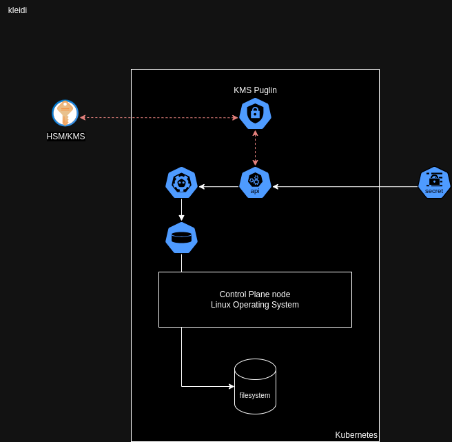
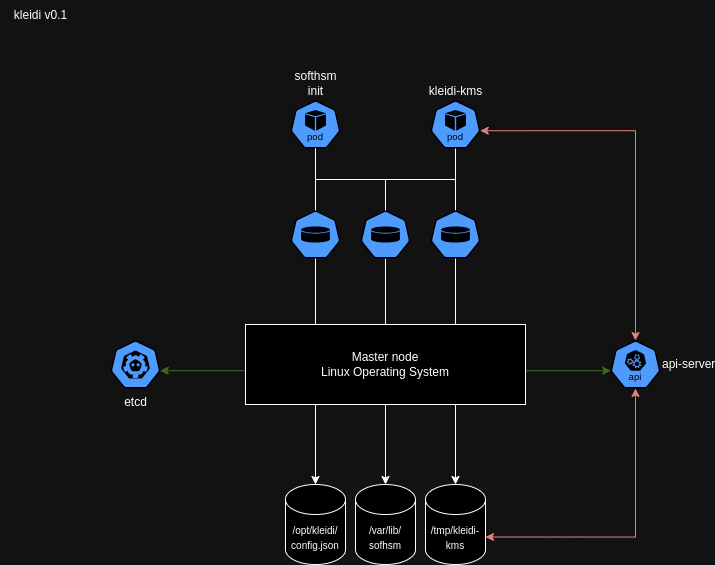

# kleidi KMS provider plugin for Kubernetes

## Origin of kleidi


Initially, [romdalf](https://github.com/romdalf) founded [Trousseau](https://trousseau.io) in 2019 and released a production-grade KMSv1 provider plugin during his tenure at Ondat.  

With the Kubernetes project moving to KMSv2 stable at 1.29 and KMSv1 being deprecated since 1.27, a decision needed to be made regarding rewriting the plugin, leading to the creation of kleidi.

The origin is Greek, and the meaning is "key". (Source: [Wikipedia](https://en.wiktionary.org/wiki/%CE%BA%CE%BB%CE%B5%CE%B9%CE%B4%CE%AF))

<br clear="left"/>
<br clear="left"/>

## Current state
* KMSv2 with Kubernetes 1.29 and onwards.
* PKCS#11 interface to [SoftHSM](https://www.opendnssec.org/softhsm/) deployed on the control plane nodes.   
  **Note: it is intended to be used for PoC only, not for production use.**

## Why 1.29 or later?
***Stability!***   

Any prior release marked KMSv2 as non-stable. Here is the extract from the [Kubernetes documentation](https://kubernetes.io/docs/tasks/administer-cluster/kms-provider/#before-you-begin):  
*The version of Kubernetes that you need depends on which KMS API version you have selected. Kubernetes recommends using KMS v2.*   
* *If you selected KMS API v2, you should use Kubernetes v1.29 (if you are running a different version of Kubernetes that also supports the v2 KMS API, switch to the documentation for that version of Kubernetes).*
* *If you selected KMS API v1 to support clusters before version v1.27 or if you have a legacy KMS plugin that only supports KMS v1, any supported Kubernetes version will work. This API is deprecated as of Kubernetes v1.28. Kubernetes does not recommend the use of this API.*

## Future state  
* production-grade SoftHSM implementation. 
* HashiCorp Vault Community Edition/openbao integration.
* (v)TPM integration (see R&D)

# Why a KMS provider plugin for Kubernetes? 

This is related to security exposure and how credential handling practices differ between application and infrastructure management with [physical/virtual] machines and with a container platform like Kubernetes. 

More to be said and understood with [Kubernetes Secrets Handbook](https://www.amazon.com/Kubernetes-Secrets-Handbook-production-grade-management/dp/180512322X)

## Physical/Virtual machine world
The entire IT organization is segmented into knowledge domains such as networking, storage, computing, and applications in the legacy world. 
When an application team asks for a virtual machine:
* The VMware Team has its credentials, which the Linux team cannot access.
* The Linux team will configure, maintain, and support the operating system and not share their credentials with any other team. 
* The application team will deploy their application, which might be connected to a database; the DBA will provide credentials.   
This quick overview can be enriched with all other layers like storage, backup, networking, monitoring, etc.
None will cross-share their credentials.

## Container platform world
Within Kubernetes, the states and configurations of every component, from computing to networking to applications and more, are stored within the ```etcd``` key-value datastore. 

Even if cloud-native applications can interact directly with a KMS provider like Vault, application and platform credentials are still stored within the cluster. This might also include the token to connect with the KMS provider.

All data fields are encoded in base64 but not encrypted. 

## Security exposures

The following diagram takes a 10,000-feet overview to explore the security exposures leading to a potential secret leaking/spilling: 



* The secret comes from an external source and needs to be injected.  
* The base64 encoded secret will be ingested via the API server. 
* If a Kubernetes KMS provider plugin exists, the API server encrypts the data field using an envelope encryption scheme. 
* The secret and encrypted data filed will be stored within the ```etcd``` key-value datastore. 
* The ```etcd``` key-value datastore file is saved on a local volume on the control plane node filesystem. 

What are the exposures:

|Exposure | Risk | Mitigation |
|---------|------|------------|
|The secret comes from an external source. It requires a base64-encoded payload. | This transformation is a first-level exposure of the data field at file and console levels. | Work an injection mechanism from the password manager or KMS |  
| A common mistake is committing the secret YAML definition to a Git repository. | The credentials are exposed for life and will need to be rotated. | Don't include any YAML manifest with sensitive data in a Git repository even for testing purposes. Using a tool like SOPS can help prevent such scenario | 
| If no KMS provider plugin exists. | The API server stores the base64-encoded secret within the ```etcd``` key-value datastore. | Application secrets might benefit from an external KMS. Platform secrets will require a data encryption at rest option provided by Kubernetes. |
| If a KMS provider plugin exists. | The encryption Key or credentials to access the KMS or HSM are exposed in clear text. | Set up a mTLS authentication if possible. |
| The ```etcd``` key-value datastore is stored on the control plane filesystem. | The datastore file can be accessed if the node is compromised. | Encrypting the filesystem helps secure the datastore file from being read, except if the node has been compromised with root access. |
| The API server is the Kubernetes heart and soul. | If the appropriate RBAC or the API server is compromised, all protective measures will be useless since the API server will decrypt all sensitive data fields. | RBAC and masking the API server if possible | 

Thanks to Red Hat colleagues Francois Duthilleul and Frederic Herrmann for spending time analyzing the gaps.

# Implementation
## kleidi v0.1 
kleidi has bootstrapped a code base from the [Kunernetes mock KMS plugin](https://github.com/kubernetes/kms/tree/master/internal/plugins/_mock). This provides a PKCS#11 interface for a local software HSM like [SoftHSM](https://www.opendnssec.org/softhsm/).

The code provides the following:   
* KMSv2 support tested with Kubernetes 1.29 and onwards. 
* PCKS#11 interface to SoftHSM.
* DaemonSet deployment.
* Logging subsystem. 
* Plugin configuration.
* HashiCorp Vault and TPM package module placeholders.

Based on a gRPC architecture requirement from the Kubernetes project, kleidi lives close to the API server on the master node(s).   
kleidi depends on a custom ```initContainer``` to streamline the bootstrap of both SoftHSM and PCKS#11 interface using two volumes:   
* ```/opt/kleidi/``` to store the ```config.json``` 
* ```/var/lib(64)/softhsm/``` to set up the HSM token 

With successful ```initContainer```, the ```kleidi-kms-plugin``` container starts and accesses three volumes:   
* ```/opt/kleidi/``` to access the ```config.json``` 
* ```/var/lib(64)/softhsm/``` to access the token 
* ```/tmp/kleidi``` to create the gRPC socket 



***This version is a PoC and should never be used in production-grade environments.***

## kleidi R&D
Considering the security exposures described in this README, an in-platform solution leveraging the (v)TPM chipset is currently designed and tested.

# Test

The current testing is done using ```kind``` with the following configuration:

```YAML
kind: Cluster
apiVersion: kind.x-k8s.io/v1alpha4
name: kind-kleidi
nodes:
- role: control-plane
  image: kindest/node:v1.29.2@sha256:51a1434a5397193442f0be2a297b488b6c919ce8a3931be0ce822606ea5ca245
  extraMounts:
    - containerPath: /etc/kubernetes/encryption-config.yaml
      hostPath: configuration/k8s/encryption/encryption-config.yaml
      readOnly: true
      propagation: None 
    - containerPath: /etc/kubernetes/manifests/kube-kms.yaml
      hostPath: configuration/k8s/deploy/pod-kleidi-kms.yaml
      readOnly: true
      propagation: None
    - containerPath: /opt/softhsm/config.json
      hostPath: configuration/softhsm/config.json
      readOnly: true
      propagation: None
  kubeadmConfigPatches:
  - |
    kind: ClusterConfiguration
    apiServer:
      extraArgs:
        encryption-provider-config: "/etc/kubernetes/encryption-config.yaml"
        encryption-provider-config-automatic-reload: "true"
        v: "5"
      extraVolumes:
        - name: encryption-config
          hostPath: /etc/kubernetes/encryption-config.yaml
          mountPath: /etc/kubernetes/encryption-config.yaml
          readOnly: true
          pathType: File
        - name: softhsm
          hostPath: /opt/softhsm/config.json
          mountPath: /opt/softhsm/config.json
          readOnly: false
          pathType: File
        - name: kleidi-socket
          hostPath: /tmp/kleidi
          mountPath: /tmp/kleidi
      scheduler:
        extraArgs:
          v: "5"
      controllerManager:
          v: "5"
- role: worker
  image: kindest/node:v1.29.2@sha256:51a1434a5397193442f0be2a297b488b6c919ce8a3931be0ce822606ea5ca245
```

This configuration is available in ```configuration/k8s/kind/kind.yaml``` and a test ```kind``` cluster can be created using the following command:

```
kind create cluster --config configuration/k8s/kind/config.yaml
```

Expected output:
``` 
Creating cluster "kind-kleidi" ...
 ✓ Ensuring node image (kindest/node:v1.29.2) 🖼
 ✓ Preparing nodes 📦 📦  
 ✓ Writing configuration 📜 
 ✓ Starting control-plane 🕹️ 
 ✓ Installing CNI 🔌 
 ✓ Installing StorageClass 💾 
 ✓ Joining worker nodes 🚜 
Set kubectl context to "kind-kind-kleidi"
You can now use your cluster with:

kubectl cluster-info --context kind-kind-kleidi

Not sure what to do next? 😅  Check out https://kind.sigs.k8s.io/docs/user/quick-start/
``` 

Note that the successful creation of the ```kind``` equals the successful deployment of ```kleidi``` as we can verified this with the following command:

```
kubectl get all -A
```

Expected output
```
NAMESPACE            NAME                                                    READY   STATUS    RESTARTS   AGE
kube-system          pod/coredns-76f75df574-4qbz2                            1/1     Running   0          4m2s
kube-system          pod/coredns-76f75df574-g6nnf                            1/1     Running   0          4m2s
kube-system          pod/etcd-kind-kleidi-control-plane                      1/1     Running   0          4m23s
kube-system          pod/kindnet-k4rpw                                       1/1     Running   0          4m
kube-system          pod/kindnet-rwv8v                                       1/1     Running   0          4m2s
kube-system          pod/kleidi-kms-plugin-kind-kleidi-control-plane         1/1     Running   0          4m19s
kube-system          pod/kube-apiserver-kind-kleidi-control-plane            1/1     Running   0          4m18s
kube-system          pod/kube-controller-manager-kind-kleidi-control-plane   1/1     Running   0          4m26s
kube-system          pod/kube-proxy-8kfft                                    1/1     Running   0          4m
kube-system          pod/kube-proxy-bmqxl                                    1/1     Running   0          4m2s
kube-system          pod/kube-scheduler-kind-kleidi-control-plane            1/1     Running   0          4m25s
local-path-storage   pod/local-path-provisioner-7577fdbbfb-vrdk6             1/1     Running   0          4m2s
```

A test secret can be created using the following command:

```
kubectl create secret generic encrypted-secret -n default --from-literal=mykey=mydata
```

The payload encryption can be verified with the following command:

``` 
kubectl -n kube-system exec etcd-kind-kleidi-control-plane -- sh -c "ETCDCTL_ENDPOINTS='https://127.0.0.1:2379' ETCDCTL_CACERT='/etc/kubernetes/pki/etcd/ca.crt' ETCDCTL_CERT='/etc/kubernetes/pki/etcd/server.crt' ETCDCTL_KEY='/etc/kubernetes/pki/etcd/server.key' ETCDCTL_API=3 etcdctl get /registry/secrets/default/encrypted-secret" | hexdump -C
```

Expected ouptut:

```
00000000  2f 72 65 67 69 73 74 72  79 2f 73 65 63 72 65 74  |/registry/secret|
00000010  73 2f 64 65 66 61 75 6c  74 2f 65 6e 63 72 79 70  |s/default/encryp|
00000020  74 65 64 2d 73 65 63 72  65 74 0a 6b 38 73 3a 65  |ted-secret.k8s:e|
00000030  6e 63 3a 6b 6d 73 3a 76  32 3a 6b 6c 65 69 64 69  |nc:kms:v2:kleidi|
00000040  2d 6b 6d 73 2d 70 6c 75  67 69 6e 3a 0a a9 02 df  |-kms-plugin:....|
00000050  44 21 c9 94 2f a6 47 08  d1 9d ad 55 30 96 93 2c  |D!../.G....U0..,|
00000060  68 88 5c a7 c7 55 46 53  a6 8c 71 75 f4 e2 ff 68  |h.\..UFS..qu...h|
00000070  d2 6a 10 78 3c 18 6f f6  02 de 79 3c 50 b9 93 97  |.j.x<.o...y<P...|
00000080  90 13 8c 44 93 51 99 cf  0f 9b 18 30 51 92 96 e8  |...D.Q.....0Q...|
00000090  ca a2 ad 19 ce 19 34 0f  4a 85 0b ee 5a cf 61 3a  |......4.J...Z.a:|
000000a0  e1 56 84 6d 4f 71 bc bb  da df 41 05 35 02 c8 af  |.V.mOq....A.5...|
000000b0  93 4f e0 20 ad 9d a4 3d  5b 93 b5 98 e6 fb 85 74  |.O. ...=[......t|
000000c0  c5 ab cf 91 2e 1f d8 c1  58 45 af e8 02 cf 54 13  |........XE....T.|
000000d0  f6 ad 18 1e 53 7c a4 10  32 da da 63 c6 a1 78 29  |....S|..2..c..x)|
000000e0  8a 9d 42 a7 30 77 92 3f  75 cc a3 49 f1 c0 7d f3  |..B.0w.?u..I..}.|
000000f0  8f 08 af c0 43 5d 2f 29  6e 70 2c 01 c8 86 f7 4e  |....C]/)np,....N|
00000100  8b ba 7d 02 34 83 c2 9c  a4 14 b5 f2 a0 70 a6 5c  |..}.4........p.\|
00000110  86 38 f0 e7 a4 c1 e6 9f  4b 84 f2 3d 80 10 2d 16  |.8......K..=..-.|
00000120  15 78 87 84 9c 69 f8 9c  21 c2 98 dc 28 fc 1b e6  |.x...i..!...(...|
00000130  82 46 ca 70 1e be 8a c5  c7 9c 85 eb d6 57 41 f0  |.F.p.........WA.|
00000140  fa ef c7 be 10 c4 1c 22  cd b5 f4 b0 fe cb bb ae  |......."........|
00000150  dc c2 96 7d ef 6f 14 a8  97 f4 0a 98 f4 5f 5f 60  |...}.o.......__`|
00000160  b8 71 72 63 bf 34 c9 4f  53 9c 41 7b 20 1d 3a f2  |.qrc.4.OS.A{ .:.|
00000170  fe c8 5d da 40 9f 15 e7  12 11 6b 6c 65 69 64 69  |..].@.....kleidi|
00000180  2d 6b 6d 73 2d 70 6c 75  67 69 6e 1a 40 c5 a5 22  |-kms-plugin.@.."|
00000190  a7 7e 0e 14 f6 1c 38 49  b5 0a c0 20 ba 75 5a 5e  |.~....8I... .uZ^|
000001a0  c9 a6 c8 02 c9 d2 27 7a  64 54 66 74 45 2c 82 31  |......'zdTftE,.1|
000001b0  61 14 50 1e c8 d9 43 1f  4f 96 0f 47 34 eb 69 28  |a.P...C.O..G4.i(|
000001c0  1b ef bf f8 b5 86 47 c8  75 87 f6 25 95 22 21 0a  |......G.u..%."!.|
000001d0  1c 76 65 72 73 69 6f 6e  2e 65 6e 63 72 79 70 74  |.version.encrypt|
000001e0  69 6f 6e 2e 72 65 6d 6f  74 65 2e 69 6f 12 01 31  |ion.remote.io..1|
000001f0  28 01 0a                                          |(..|
000001f3
```

The above extract shows an encrypted payload with the header ```enc:kms:v2:kleidi-kms-plugin:```.


# Deployment

---TODO---
The current implementation has been tested on:   
* Kind
* RKE2 
Considering this technical requirement and Akamai's acquisition of Ondat.io, which sponsored Trousseau's development, the best course of action was to deprecate Trousseau. 


