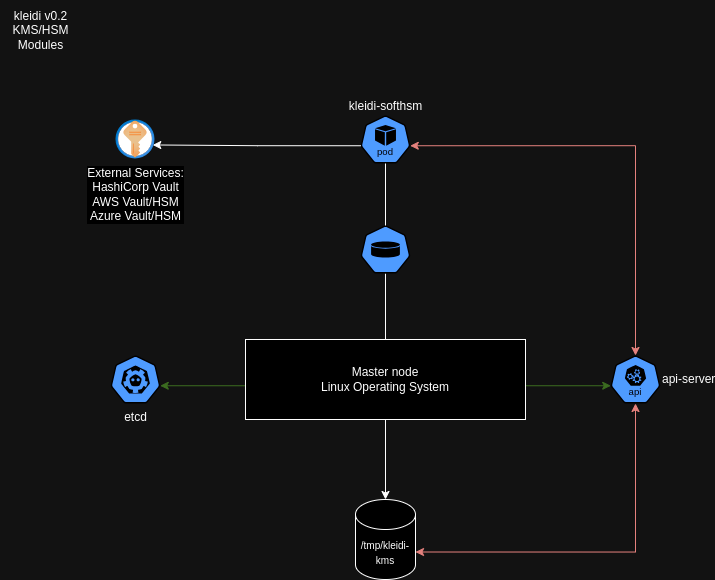

# kleidi KMS Provider Plugin for Kubernetes

The current implementation of Kleidi provides the followings features:

* support **only** the KMSv2 marked as stable from Kubernetes version 1.29 and onwards. 
* support of the original PKCS#11 interface backed by backed by [SoftHSM](https://www.opendnssec.org/softhsm/). It is intended to be used for testing only and not for production use.
* support HashiCorp Vault Community Edition. 

# implementation 

## kleidi v0.1

Kleidi is based on the [Kunernetes mock KMS plugin](https://github.com/kubernetes/kms/tree/master/internal/plugins/_mock) to showcase the usage of a PKCS#11 interface with a local software HSM based on the project [SoftHSM](https://www.opendnssec.org/softhsm/).

The code provides the following:

* the support of Kubernetes KMSv2 only - currently tested and working with Kubernetes 1.29 and onwards. 
* a PCKS#11 interface to SoftHSM. 

The kleidi brings the following improvements:

* 
* a generic bootstrap and deployment agnostic of the Linux flavor
* a logging susbsystem 
* an improved configuration
* a HashiCorp Vault package module placeholder

Based on a gRPC architecture requirement from the Kubernetes project, Kleidi lives in closed proximity with the API server on the master node(s). 

Kleidi v0.1 is very closed to the mock plugin which means it depends on an initContainer to bootstrap the SoftHSM and the PCKS#11 interface using two volumes:

* /opt/kleidi/ to store the config.json
* /varl/lib(64)/softhsm/ to set up the HSM token 

When successful, the kleidi container will start and will need to access three volumes:

* /opt/kleidi/ to access the config.json
* /var/lib(64)/softhsm/ to access the token 
* /tmp/ to create the gRPC socket 


This version is a PoC and should never be used in production-grade environments. 

### Deploy

The current implementation has been tested on:

* kind
* rke2 

The ```platform/softhsm/config.json``` is using a ```lib64``` path for RHEL-based container images like the provided init image.

## kleidi r&d

Two versions of kleidi is anticipated:

* a module-based architecture per vault and HSM services
* a SoftHSM embedded architecture 

### module-based architecture



### SoftHSM embedded architecture


